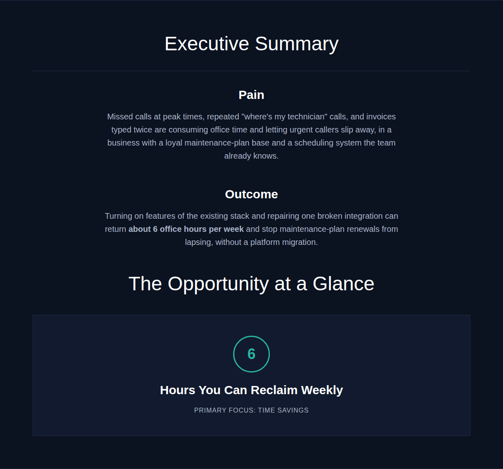
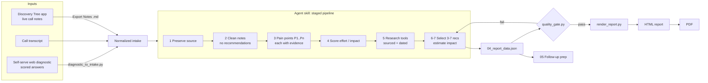
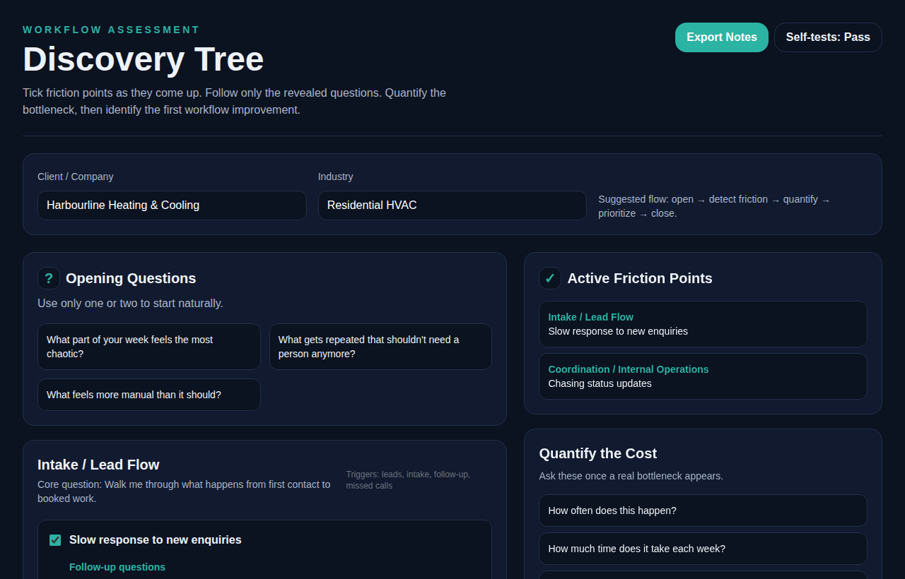
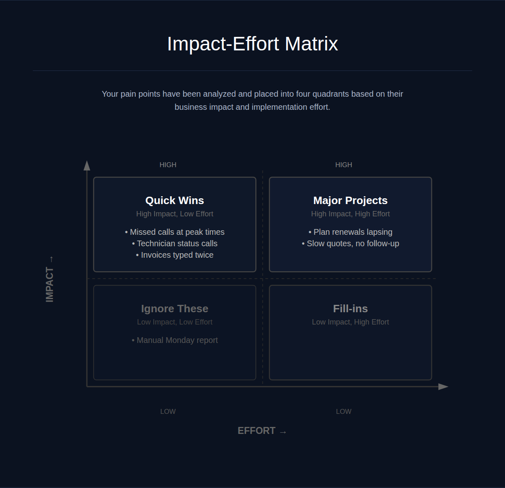

# Agentic Assessment Pipeline

An agent-driven pipeline that turns a small-business discovery conversation into an evidence-backed
workflow assessment report: ranked pain points, an effort/impact matrix, 3 to 7 recommendations, a
4-day quick-win plan, and a Markdown, HTML and PDF report.

This is a public, generalized version of a private system I use in my consulting practice. The
architecture, guardrails, rendering and quality gate are the real design. The question bank, prompt wording,
scoring weights and branding are simplified examples, and the sample engagement is fictional.



## Architecture



### Design decisions

- **Two kinds of input, one back-end.** A recorded call and a self-serve web diagnostic capture very
  different data. Adapters normalize both into the same intake shape, so every downstream stage is
  input-agnostic and a new input type only needs a new adapter.
- **Staged artifacts, not one big prompt.** Each stage writes a file (`00` to `05`) and reads only earlier
  files. Every intermediate result can be inspected, and a bad stage can be rerun on its own instead of
  regenerating everything.
- **The model writes data; code renders it.** The agent's final output is `04_report_data.json`, not HTML.
  Layout is deterministic, and the data can be validated before anything reaches a client.
- **Guardrails enforced in code.** `quality_gate.py` turns the skill's rules into checks: 3 to 7
  recommendations with exactly 3 top priorities, every recommendation traced to a pain point, every pain
  point backed by a quote from the input, every price sourced with a date or marked `needs verification`,
  and no unreplaced placeholders. The agent loops until the gate passes.
- **Human in the loop.** The pipeline produces a report and a walkthrough plan for a person to review with
  the client. It does not send anything on its own.

## Repository layout

```text
skill/                     Agent skill: stage definitions, guardrails, report schema, HTML template
  SKILL.md
  references/stage-prompts.md
  references/report-data-schema.md
  assets/report-template.html
pipeline/                  Deterministic code the agent calls
  render_report.py         report data (JSON) -> HTML via a small Mustache-style renderer
  quality_gate.py          validates report data and rendered HTML; exit 1 on failure
  adapters/diagnostic_to_intake.py   scored web diagnostic -> intake Markdown
  tests/                   unit tests (stdlib unittest, no dependencies)
discovery-app/             React + Vite + Tailwind companion app for live discovery calls
examples/harbourline-hvac/ Fictional end-to-end run: inputs and every stage artifact (00-05)
```

## Try it

Python 3.10+ with no third-party packages:

```bash
# Convert the sample diagnostic submission into an intake document
python pipeline/adapters/diagnostic_to_intake.py examples/harbourline-hvac/input/diagnostic_submission.json

# Render the sample report and run the quality gate
python pipeline/render_report.py examples/harbourline-hvac/output/04_report_data.json
python pipeline/quality_gate.py  examples/harbourline-hvac/output/04_report_data.json

# Tests
python -m unittest discover pipeline/tests
```

Discovery app (Node 18+):

```bash
cd discovery-app
npm install
npm run dev     # open the local URL, tick friction points, Export Notes
npm test        # unit tests for the question bank and export logic
```

To run the full pipeline, point an agent that supports skills (for example Claude Code or Codex) at
`skill/SKILL.md` and give it one of the inputs in `examples/harbourline-hvac/input/`.

## Sample output

The fictional [Harbourline Heating & Cooling](examples/harbourline-hvac/) engagement shows every
artifact the pipeline produces, from the [cleaned notes](examples/harbourline-hvac/output/01_cleaned_notes.md)
to the [pain point analysis](examples/harbourline-hvac/output/02_pain_point_analysis.md) and the final
[report (PDF)](examples/harbourline-hvac/output/04_assessment_report.pdf). Vendor prices in the sample are
deliberately left as `needs verification`, which is how the pipeline marks claims it has not checked.

| Discovery Tree app | Impact-effort matrix |
|---|---|
|  |  |

## License

MIT
